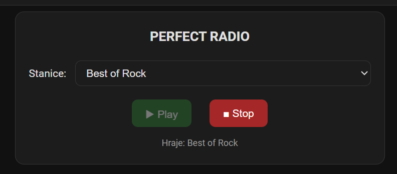

# Perfect Radio

Perfect Radio is a custom Home Assistant integration with a built-in catalogue of internet radio stations and a zero-configuration Lovelace card for playback in the current web browser.

## Features

- built-in station catalogue from `stations.xml`
- station selection directly on the dashboard
- Play / Stop controls
- playback in the current Home Assistant web browser
- automatic station switching while playback is active
- Home Assistant actions `perfect_radio.play` and `perfect_radio.stop` for standard `media_player` targets
- automatic Lovelace frontend resource registration
- frontend cache busting based on a SHA-256 hash of the JavaScript file
- GUI installation through **Settings → Devices & services → Add integration → Perfect Radio**



## Installation with HACS

1. Open HACS in Home Assistant.
2. Add `https://github.com/bobobubo/perfect-radio` as a **Custom repository** of type **Integration**.
3. Download **Perfect Radio**.
4. Restart Home Assistant.
5. Go to **Settings → Devices & services → Add integration** and add **Perfect Radio**.
6. Edit a dashboard, choose **Add card**, then select **Perfect Radio**.

No YAML configuration of the card is required.

## Manual installation

Copy the directory:

```text
custom_components/perfect_radio
```

to:

```text
/config/custom_components/perfect_radio
```

Restart Home Assistant and add the integration from **Settings → Devices & services**.

## Dashboard card

The default card requires no configuration. Home Assistant creates it as:

```yaml
type: custom:perfect-radio-card
```

The card automatically finds the Perfect Radio select entity.

## Actions

Perfect Radio registers:

- `perfect_radio.play`
- `perfect_radio.stop`

`perfect_radio.play` may optionally receive a `station_id`. Without it, the currently selected station is used. Both actions use the standard Home Assistant target mechanism for `media_player` entities.

## Station catalogue

The built-in station list is located at:

```text
custom_components/perfect_radio/stations.xml
```

Version: **0.1.1**
